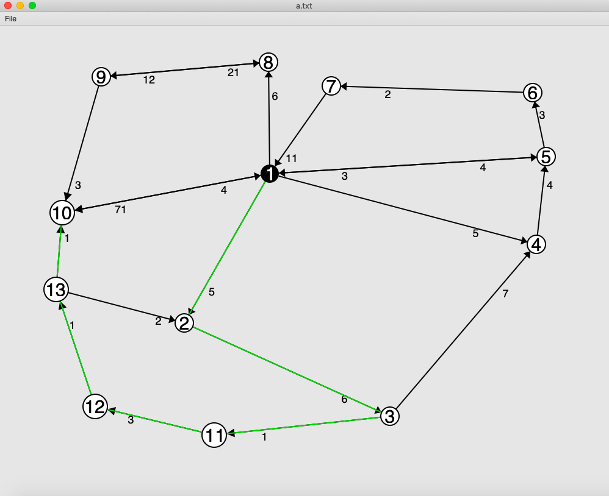

## A weighted directed graph implementation in C#

The user can create new vertices by holding down Shift and clicking in the window.
A new vertex will automatically be assigned the next available integer ID.

An any moment there may be a selected vertex, which appears black. All other vertices are white in this case. 
A newly created vertex is automatically selected. The user can click any other vertex to select it. 
If the user clicks in the window outside any vertices, then the selection is cleared, i.e. no vertices are selected.

The user can hold down Control and click any vertex V to create a directed edge between the selected vertex and V. 
If there is already an edge between the selected vertex and V, then this action removes that edge.

The user can click any vertex and drag it with the mouse to change its position. 
As the vertex moves, all edges that are attached to it move as well.

If the user presses the d key, the selected vertex is deleted, along with all edges that are attached to it.

The user can also click and edit the weight of any edge. Any changes will be applied after pressing the Enter button or clicking anywhere else in the application window.

__The File menu contains these menu items:__

  1. __New__ - Delete all vertices and edges, i.e. start over with a new graph.

  2. __Open__ - Prompt the user for a filename, then read the graph from that file.

  3. __Save__ - Save the graph to a file. If the graph was previously read from a file, it is saved back to that same file. 
                If not, the program prompts the user for a filename where the graph should be saved.

  4. __Quit__ - Exit the application.

## A visual session of the application:

